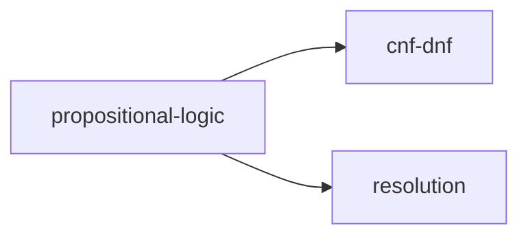

# AI-KOS Technical Specification
# Version 1.5

> **Status:** Authoritative
> **Version:** 1.5.0
> **Target Hardware:** Ubuntu Linux | Intel Core Ultra 7 255HX | 32 GB RAM | NVIDIA RTX 5070 Ti (16 GB VRAM) | 300 GB SSD + 3 TB NAS
> **Derived from:** AI-KOS v1.0-v1.4 evolution; Architectural Convergence Report; OKF v0.1 specification

---

## Table of Contents

1. [System Overview](#1-system-overview)
2. [Repository & Directory Layout](#2-repository--directory-layout)
3. [Agent Navigation Files](#3-agent-navigation-files)
4. [Services](#4-services)
5. [Data Schemas](#5-data-schemas)
6. [Agent Definitions](#6-agent-definitions)
7. [Ingestion Pipeline](#7-ingestion-pipeline)
8. [Retrieval Pipeline](#8-retrieval-pipeline)
9. [Governance Pipeline](#9-governance-pipeline)
10. [Cognitive Skins](#10-cognitive-skins)
11. [Routing Layer](#11-routing-layer)
12. [Databases & Storage](#12-databases--storage)
13. [Schedules & Jobs](#13-schedules--jobs)
14. [Message Formats & Protocols](#14-message-formats--protocols)
15. [APIs](#15-apis)
16. [CI/CD Quality Pipeline](#16-cicd-quality-pipeline)
17. [Docker & Deployment](#17-docker--deployment)
18. [Health Monitoring](#18-health-monitoring)
19. [Integrations](#19-integrations)
20. [Open-Source Integration & Orchestration](#20-open-source-integration--orchestration)
21. [Hardware-Specific Optimization](#21-hardware-specific-optimization)
22. [Engineering Roadmap](#22-engineering-roadmap)

---

## 1. System Overview

### 1.1 Definition

AI-KOS (Artificial Intelligence Knowledge Operating System) is a persistent cognitive operating system. It externalizes memory, consolidates knowledge, and provides reasoning support independently of any single language model. The system is not a chatbot, a traditional RAG pipeline, or merely an Obsidian vault. It actively maintains, organizes, reviews, and retrieves a structured knowledge base that is fully decoupled from individual sessions.

The core insight driving AI-KOS is the separation of concerns between:

1. **Raw information** — unprocessed input
2. **Temporary memory** — session and episodic context
3. **Consolidated knowledge** — stable semantic understanding
4. **Retrieval** — efficient context access
5. **Reasoning** — model execution guided by the knowledge store

### 1.2 Core Principles

1. Raw information is not knowledge.
2. Knowledge must be consolidated before it becomes durable.
3. AI and humans need different views of information (dual-layer articles).
4. Retrieval must minimize token usage — load only what is necessary.
5. Knowledge evolves over time through confidence decay and review.
6. Templates become procedural memory, reducing reasoning overhead.
7. Humans remain in control of all semantic state changes.

### 1.3 Document Architecture Decision

A foundational architectural decision is the choice between the LLM Wiki pattern and traditional RAG for the primary knowledge store.

| Evaluation Criterion | LLM Wiki / OKF Pattern (AI-KOS default) | Retrieval-Augmented Generation (RAG) |
|---|---|---|
| Document volume | Optimized for < 1,000 structured files | Designed for > 1,000–10,000+ unstructured files |
| Content stability | Stable documentation, procedures, standards | Rapidly changing logs, dynamic streams |
| Knowledge structure | Hierarchical, structured, policy-like | Long-form prose, transcripts, raw text |
| Retrieval precision | Deterministic; exact complete document context | Probabilistic; semantic similarity, risk of fragmentation |
| Engineering overhead | Low; file directories + system prompts | High; embedding pipelines, vector indexing |
| Auditability | High; human-readable, Git-compatible | Low; updates stored as vector coordinates |

**Decision:** AI-KOS defaults to the Open Knowledge Format (OKF) v0.1 specification — a vendor-neutral, portable standard published by Google Cloud that formalizes knowledge as a directory of Markdown files with YAML frontmatter, connected by relative Markdown links that form an agent-traversable concept graph. As the corpus scales beyond 1,000 files, the file-based layer is paired with dual-engine hybrid vector + lexical indexing (Section 8) and open-source pipeline components are adopted to reduce bespoke engineering risk.

### 1.4 Architectural Layers

| Layer | Purpose | Primary Storage |
|---|---|---|
| Information | Raw input capture | `inbox/` |
| Memory | Episodic & session experiences | `episodes/`, `backlog/` |
| Knowledge | Consolidated semantic understanding | `knowledge/` (OKF-compliant) |
| Procedure | Structured reasoning templates | `templates/` |
| Retrieval | Multi-stage hybrid access pipeline | Qdrant (dense + sparse) + Obsidian |
| Reasoning | Model execution via skins | Model router |
| Governance | Tiered quality control + CI/CD | Governance service + Git pipeline |
| Orchestration | Durable agent workflow and long-running state | Temporal / Restate / LangGraph |

### 1.5 Data Flow Summary

```
External Source
      |
  Ingestion (Docling parsing -> structure-aware chunking)
      |
   Inbox
      |
  CI/CD Linting + Schema Validation (okf-author / Pydantic)  <-- structural gate only
      |
  Scoring & Triage
      |
  Backlog
      |
  Consolidation Agent (OKF-structured articles)  <-- semantic governance gate
      |
  Knowledge Articles
      |
  Summaries & Indexes
      |
  Qdrant (dense + sparse) + Obsidian Graph
```

### 1.6 Epistemic Model

AI-KOS introduces per-article confidence scores, dynamic stability classes, temporal decay metrics, and gap articles to track known unknowns. This systematic uncertainty tracking prevents the silent quality loss common in production RAG systems — standard retrieval systems without proactive decay and validation pipelines can lose significant accuracy within a year of deployment due to stale context and informational drift.

The "snippet-first" retrieval architecture (Sections 7, 8) resolves the chunk-sizing dilemma: small chunks provide search precision but lack context; large chunks provide context but produce diffuse embeddings that reduce recall. AI-KOS loads only the matching child chunk at retrieval time, fetches the parent on demand, and never loads the full article by default.

### 1.7 Epistemic Model

AI-KOS introduces per-article confidence scores, dynamic stability classes, temporal decay metrics, and "gap" articles to track known unknowns. This systematic uncertainty tracking prevents the silent quality loss that affects production RAG systems. Standard retrieval systems without proactive decay and validation pipelines can lose 20–30 percentage points of accuracy within a year of deployment due to stale context and informational drift.

Additionally, the "snippet-first" retrieval architecture provides a highly efficient way to reference long-form documents. By loading only the relevant child chunk at retrieval time rather than the entire parent file, AI-KOS keeps the generative model's context window clean.

---

## 2. Repository & Directory Layout

```
ai-kos/
├── START_HERE.md               # Entry point for agents and humans
├── KNOWLEDGE_BASE.md           # Central index with concept clusters
├── AGENTS.md                   # Agent behavioural instructions
│
├── inbox/                      # Raw unprocessed input
├── backlog/                    # Processed, unconsolidated items
├── archive/                    # Superseded articles (with warning banners)
├── episodes/                   # Episodic memory records
│
├── knowledge/                  # Semantic memory (OKF vault root)
│   ├── bundles/                # OKF bundle directories
│   │   ├── technology/
│   │   ├── research/
│   │   ├── projects/
│   │   └── gaps/               # Known unknowns
│   └── .okf/                   # OKF manifest and bundle index
│
├── templates/                  # Procedural memory templates
│   ├── concept.yaml
│   ├── project.yaml
│   ├── process.yaml
│   ├── research.yaml
│   ├── decision.yaml
│   ├── technology.yaml
│   ├── programming_concept.yaml
│   ├── agent.yaml
│   └── problem.yaml
│
├── indexes/                    # Executive memory indexes
├── summaries/                  # Multi-level summaries
│   ├── section/
│   ├── article/
│   ├── category/
│   └── domain/
│
├── sessions/                   # Temporary session context
├── logs/                       # Query logs, retrieval history, failures
│   └── meta/                   # Weekly meta-learning reports
│
├── skins/                      # Cognitive skin definitions
│   ├── hermes.yaml
│   ├── research.yaml
│   ├── coding.yaml
│   ├── critic.yaml
│   ├── pm.yaml
│   └── consolidator.yaml
│
├── agents/                     # Agent configuration and prompts
├── config/                     # System configuration
│   ├── config.yaml
│   ├── pydantic_schemas/       # YAML validation models
│   └── searxng/
│
├── .github/
│   └── workflows/
│       └── knowledge-ci.yml    # CI/CD quality pipeline
│
├── docker/
└── services/
    ├── ingestion/
    │   └── on_watch.py         # Folder watcher for inbox/
    ├── consolidation/
    ├── retrieval/
    ├── governance/
    ├── router/
    ├── scheduler/
    ├── health/
    ├── session/
    └── graph/
```

---

## 3. Agent Navigation Files

Three standardized root-level files guide agents entering the repository. These are maintained by the consolidation agent and the CI/CD pipeline.

### 3.1 START_HERE.md

Entry point for both humans and autonomous agents.

Required sections:
- Project overview (2–3 sentences)
- Active sprints / current focus
- Team or owner information
- Pointers to `KNOWLEDGE_BASE.md`, `AGENTS.md`, and Tier 1 bundles
- Last updated timestamp

### 3.2 KNOWLEDGE_BASE.md

Central index of the repository. Maintained automatically by the graph sync agent on every article write.

Required sections:
- File index by tier (Tier 1: always loaded; Tier 2: topic-specific; Tier 3: deep reference)
- One-line summaries per article
- Concept cluster groupings by domain
- Mermaid relationship diagrams for each domain

Example concept cluster entry:

```markdown
## Cluster: Formal Logic

| Article | Confidence | Summary |
|---------|-----------|---------|
| [[propositional-logic]] | 0.92 | Core syntax and semantics of propositional logic |
| [[cnf-dnf]] | 0.88 | Normal form transformations and their applications |
| [[dpll-algorithm]] | 0.85 | Davis-Putnam-Logemann-Loveland SAT solving procedure |
```



### 3.3 AGENTS.md

Standardized behavioural instructions for any agent entering the repository.

Required sections:
- Repository layout summary
- Traversal sequence
- File modification rules (what agents may and may not change)
- Citation format expected in outputs
- Escalation triggers

### 3.4 Agentic Traversal Sequence

When executing a user query, agents follow this defined sequence:

```
STEP 1 -- INITIALIZATION
  Read START_HERE.md, KNOWLEDGE_BASE.md, and all Tier 1 files.

STEP 2 -- CONCEPT ROUTING
  Search KNOWLEDGE_BASE.md for relevant concept clusters.

STEP 3 -- DYNAMIC LOADING
  Fetch mapped files. Limit: 3-4 files per retrieval cycle to prevent
  context bloat. Expand via graph traversal if confidence is low.

STEP 4 -- GENERATION & CITATION
  Synthesize answer citing specific files and, where relevant, section
  headings or line references.
```

---

## 4. Services

### 4.1 Service Registry

| Service | Port | Responsibility |
|---|---|---|
| `ingestion-service` | 8001 | Capture, triage, score incoming items; Docling parsing; structure-aware chunking |
| `consolidation-service` | 8002 | Merge backlog items into OKF-compliant articles |
| `retrieval-service` | 8003 | Multi-stage hybrid retrieval pipeline |
| `governance-service` | 8004 | Proposer -> Critic -> Comparator -> Commit |
| `router-service` | 8005 | Task routing to appropriate model/skin |
| `scheduler-service` | 8006 | Cron jobs: decay, review, meta-learning |
| `health-service` | 8007 | Dashboard, monitoring, alerting |
| `session-service` | 8008 | Session context management |
| `graph-service` | 8009 | Obsidian graph sync, traversal, KNOWLEDGE_BASE.md maintenance; local REST/MCP integration |
| `ci-service` | 8012 | Schema validation, linting, access control enforcement; structural write gate |

> Note: `embedding-service` and `sparse-index-service` are eliminated. Qdrant now hosts dense and sparse vector generation natively via FastEmbed, removing the need for separate embedding and sparse indexing microservices.

### 4.2 Inter-Service Communication

All services communicate via HTTP REST internally. Asynchronous tasks use a durable workflow engine backed by Redis for transient metadata and a scheduler for periodic jobs.

```
redis://localhost:6379
```

Queue names:

| Queue | Purpose |
|---|---|
| `queue:ingest` | New items awaiting triage |
| `queue:validate` | Items awaiting CI/CD schema validation (structural) |
| `queue:consolidate` | Backlog items ready for consolidation (semantic) |
| `queue:govern` | Proposed changes awaiting LLM governance |
| `queue:embed` | Items awaiting dense embedding |
| `queue:sparse` | Items awaiting sparse vector encoding |
| `queue:review` | Articles flagged for review |
| `queue:supersede` | Articles flagged for archival via supercession |
| `queue:retry` | Failed tasks for retry |

---

## 5. Data Schemas

### 5.1 Inbox Item

```yaml
id: string                    # UUID
source_type: chat | pdf | note | web | code | screenshot | obsidian
source_uri: string            # Original location / URL / path
captured_at: ISO8601
raw_content: string
priority_score: float         # 0.0-1.0, auto-assigned
ttl_days: integer             # Default: 14
sensitivity_label: public | internal | confidential | restricted
status: pending | triaged | expired | consolidated
tags: [string]
session_id: string | null     # Present if captured during a session
```

### 5.2 Backlog Item

```yaml
id: string
inbox_id: string              # Source inbox item
processed_at: ISO8601
summary: string
key_concepts: [string]
suggested_article: string | null   # Target knowledge article slug
priority_score: float
status: pending | in_progress | done | archived
```

### 5.3 Episode Record

```yaml
id: string
episode_type: debugging | research | conversation | meeting | coding
started_at: ISO8601
ended_at: ISO8601
summary: string
participants: [string]
key_outcomes: [string]
related_articles: [string]    # Wikilink slugs
inbox_items: [string]         # IDs of captured raw content
session_id: string | null
```

### 5.4 Knowledge Article

Every article conforms to the OKF v0.1 structure: a YAML frontmatter AI layer followed by a Markdown body human layer.

#### AI Layer (YAML frontmatter)

All fields validated by Pydantic on every write (Section 16.2).

```yaml
---
# === Identity ===
id: string                        # UUID
title: string
slug: string                      # kebab-case; used for wikilinks and OKF bundle links

# === Classification ===
type: concept | project | research | programming_concept | agent
template: string                  # Must match a file in templates/
template_version: string          # Semantic version e.g. "v1.2.0"
category: string
domain: string

# === Quality ===
confidence: float                 # 0.0-1.0
importance: high | medium | low
stability: stable | moderate | volatile
priority: integer                 # 1-5; used for sequential prompt injection under token limits

# === Temporal ===
created_at: YYYY-MM-DD
updated_at: YYYY-MM-DD
reviewed_at: YYYY-MM-DD
next_review_at: YYYY-MM-DD

# === Retrieval ===
summary: string                   # Plain text; max 250 characters; injected into KNOWLEDGE_BASE.md
keywords: [string]                # Lowercase alphanumeric; used by sparse engine
retrieval_tags: [string]          # Domain-specific; used for metadata filtering in Qdrant
read_order: [string]              # Ordered list of section titles for sequential loading

# === Graph ===
depends_on: [string]              # Prerequisite slugs; guides agent traversal order
related: [string]                 # Lateral slugs; must stay in sync with body wikilinks

# === Provenance ===
provenance: [string]              # Source file paths, URLs, or ingest session log IDs

# === Metadata ===
retrieval_count: integer
ai_notes: string | null           # Free-form agent workspace; not shown to human readers
uncertainty_notes: string | null

# === Gaps ===
gap: boolean                      # true = known unknown
gap_question: string | null
gap_priority: float | null
gap_opened_at: YYYY-MM-DD | null
gap_resolved_at: YYYY-MM-DD | null

# === Access Control ===
sensitivity_label: public | internal | confidential | restricted
---
```

#### Human Layer (Markdown body)

Content is authored in direct, imperative style:

- **No filler:** Historical context, introductory phrasing, and conversational hedging are removed.
- **Imperative directives:** Procedures use explicit commands ("Call action X to commit changes" rather than "You should then click submit").
- **Absolute values:** Vague descriptors replaced with concrete data ("Tier A costs $30/month" not "plans are affordable").
- **Explicit outcome statements:** Every procedural section ends with an outcome declaration.

Standard sections:

```markdown
## Overview
...

## Explanation
...

## Examples
...

## Code
...

## Diagrams
...

## References
...

## Discussion
...
```

#### Soft Limits

- **Maximum 10 sections per article.** This is the 10-Step Snippet Cap: each section is a self-contained, independently retrievable snippet.
- One concept per article. Articles exceeding scope are split by the consolidation agent.

### 5.5 Template Definition

```yaml
id: string
name: string
version: string               # Semantic version e.g. "v1.2.0"
type: concept | project | process | research | decision | technology | programming_concept | agent | problem
ai_layer_fields: [string]
human_layer_sections: [string]
created_at: ISO8601
updated_at: ISO8601
usage_count: integer
```

### 5.6 Summary Record

```yaml
id: string
level: section | article | category | domain
target_id: string             # Article slug, category, or domain name
content: string               # Max 250 chars for article-level
generated_at: ISO8601
token_count: integer
```

### 5.7 Query Log Entry

```yaml
id: string
timestamp: ISO8601
query: string
skin_used: string
retrieval_stages_hit: [string]
articles_retrieved: [string]
retrieval_success: boolean
failure_reason: string | null
model_used: string
latency_ms: integer
session_id: string | null
hybrid_fusion_method: rrf | dbsf | null
reranker_used: boolean
reranker_model: string | null
reranker_candidate_k: integer | null
```

### 5.8 Gap Article

A gap article is a standard knowledge article with `gap: true` and a `gap_question` field. It records known unknowns and queues them for resolution.

### 5.9 Governance Proposal

```yaml
id: string
proposal_type: merge | edit | summarize | update | new_link | delete | migrate | supersede
target_article: string
proposed_by: proposer_agent
proposed_at: ISO8601
proposer_output: string
critic_output: string | null
comparator_score: float | null    # 0.0-1.0 agreement
decision: commit | additional_pass | escalate | null
decision_at: ISO8601 | null
human_reviewed: boolean
# For supersede proposals:
superseded_by: string | null      # Slug of the replacement article
# Governance tier used:
governance_tier: structural | semantic
```

### 5.10 Semantic Chunk (internal ingestion artifact)

Produced by the ingestion service during document parsing; not persisted long-term.

```yaml
id: string
snippet_id: string | null         # Human-readable step label e.g. "step-01"
parent_chunk_id: string | null    # Points to 2048-token parent node
source_inbox_id: string
token_count: integer              # Target: 512 tokens for child nodes
content: string
similarity_to_next: float         # Cosine similarity; breakpoint if below threshold
page_marker: string | null        # [Page N] annotation from Docling
split_marker: boolean             # Pre-calculated segmentation point
chunk_type: prose | code | table  # Determines chunking strategy applied (Section 7.4)
breadcrumb: string | null         # Contextual path prepended to chunk
```

---

## 6. Agent Definitions

All agents are event-driven, triggered by queue messages or scheduled jobs. Each agent has a defined model tier (Section 11.2).

### 6.1 Ingestion Agent

**Trigger:** New item in `queue:ingest`

**Steps:**
1. Detect file type.
2. If PDF or mixed-layout document: pass through Docling parser -> "Markdown Plus" format with page markers, vertical position markers, and split markers.
3. Apply structure-aware chunking based on content type (Section 7.4):
   - Prose: semantic cosine-similarity breakpoint chunking
   - Code: AST-aware chunking
   - Tables: summarized table pattern
4. Organize chunks into parent (2,048 tokens) / child (512 tokens) hierarchy.
5. Extract key concepts and summary.
6. Assign `priority_score` (Section 7.2).
7. Assign `ttl_days`.
8. Push to `queue:validate` (CI service -- structural gate only).
9. On validation pass: write to `inbox/`; push to `queue:consolidate` if priority > 0.6, else park in backlog.

**Model:** Small (triage/scoring steps 1, 5-9). Doc tier (14B class) for steps 2-4 (Docling post-processing, semantic chunking, concept extraction from parsed documents).

### 6.2 Consolidation Agent

**Trigger:** Item in `queue:consolidate`

**Steps:**
1. Load backlog item and related inbox items.
2. Identify target article via retrieval (Section 8).
3. Evaluate relationship to existing articles (Confirmation / Contradiction / Supercession).
4. If article exists: propose merge or edit via `queue:govern` (semantic governance gate).
5. If no article: propose new OKF-compliant article via `queue:govern`.
6. Mark backlog item `in_progress`.

**Output format constraint (10-Step Snippet Rule):** Every procedural or explanatory article produced by this agent must be structured as a maximum of 10 discrete steps/sections, each self-contained as a retrievable snippet. Each snippet must be independently meaningful -- the retrieval engine can load a single snippet without requiring the full article for context.

**Model:** Medium.

### 6.3 Proposer Agent

**Trigger:** Item in `queue:govern`

**Steps:**
1. Receive proposal type and target.
2. Generate: merge | edit | summary | update | new link | supersecession.
3. Write `proposer_output` to proposal record.
4. Push proposal to Critic.

**Model:** Strong.

### 6.4 Critic Agent

**Trigger:** Proposal with `proposer_output` set.

**Steps:**
1. Receive proposal.
2. Generate: alternatives | objections | improvements | contradictions | confidence changes.
3. Write `critic_output` to proposal record.
4. Push proposal to Comparator.

**Model:** Strong.

### 6.5 Comparator Agent

**Trigger:** Proposal with both `proposer_output` and `critic_output` set.

**Steps:**
1. Measure agreement between proposer and critic.
2. Assign `comparator_score` (0.0-1.0).
3. Apply threshold logic:
   - Score > 0.5 -> `commit`
   - Score 0.3-0.5 -> `additional_pass`
   - Score < 0.3 -> `escalate` (human review flag)
4. Write decision to proposal record.

**Model:** Medium.

### 6.6 Embedding Agent (Dense)

**Trigger:** Item in `queue:embed`

**Steps:**
1. Load article or chunk content.
2. Call embedding via Qdrant FastEmbed (nomic-embed-text, 768 dimensions).
3. Upsert dense vector in Qdrant `knowledge_articles` collection with full metadata payload.
4. Update article record with `dense_embedding_updated_at`.

**Model:** Embedding only.

### 6.7 Sparse Index Agent

**Trigger:** Item in `queue:sparse`

**Steps:**
1. Load article or chunk content.
2. Generate sparse vectors via Qdrant FastEmbed (BM25/SPLADE).
3. Upsert sparse vector in Qdrant `knowledge_articles` collection (named vector `sparse`).
4. Update article record with `sparse_embedding_updated_at`.

**Model:** Sparse encoder only.

### 6.8 Graph Sync Agent

**Trigger:** Article write or update.

**Steps:**
1. Parse `depends_on` and `related` from article frontmatter.
2. Write/update corresponding wikilinks in the Obsidian markdown body.
3. Rebuild affected sections of `KNOWLEDGE_BASE.md` (concept cluster table + Mermaid diagram).
4. Detect orphans (no inbound or outbound links); flag for review.
5. Call `geode-graph-obsidian` CLI or MCP server to refresh relationship triples.

### 6.9 Decay Agent

**Trigger:** Scheduled (daily, Section 13).

**Steps:**
1. For each article, compute weeks elapsed since `next_review_at` (if overdue; otherwise skip).
2. Apply exponential decay formula (Section 12.1).
3. Clamp confidence to [0.0, 1.0].
4. For each article whose confidence dropped below the critical threshold (default: 0.3):
   - Push to `queue:review`.
   - Propagate review flags to all articles listing it in `depends_on`.

### 6.10 Ingestion Reconciliation Agent

**Trigger:** After similarity search during consolidation, when relationship is determined.

Three outcomes:

| Relationship | Action |
|---|---|
| Confirmation | Boost confidence of existing article. Push confidence update via governance. |
| Contradiction | Lower confidence of affected article. Flag for human review. Do not auto-commit. |
| Supercession | Move obsolete article to `archive/`. Add warning banner to archived file. Update all inbound relative links. Push `new_link` proposal to update graph dependencies. Recalculate affected confidence propagation chain. |

### 6.11 Meta-Learning Agent

**Trigger:** Scheduled (weekly, Section 13).

**Steps:**
1. Query query logs for retrieval failures (last 7 days).
2. Identify articles with zero retrieval in 90 days.
3. Identify templates with high article structural similarity (candidate merge).
4. Identify skins with persistent critic/proposer disagreement.
5. Identify models with elevated failure rates.
6. Identify concepts frequently queried but absent from knowledge base (-> gap article proposals).
7. Produce weekly meta-learning report written to `logs/meta/YYYY-MM-DD.md`.

**Model:** Best.

### 6.12 CI Validation Agent

**Trigger:** Item in `queue:validate`; also fires on every Git pull request.

**Steps:**
1. Run `markdownlint` on Markdown body.
2. Parse YAML frontmatter through Pydantic schema validator.
   - Verify all mandatory fields present and correctly typed.
   - Verify `sensitivity_label` is present (missing label = blocked from ingestion).
3. Verify `summary` field <= 250 characters.
4. Check `template_version` against current version; flag for migration if outdated.
5. Run glossary alignment check against defined taxonomy terms.
6. Validate lineage: `provenance` must contain at least one reference.
7. On pass: push to next queue step. On fail: return error report to submitter.

> This agent handles structural validation only. It does not invoke any LLM. Semantic quality is handled exclusively by the Proposer -> Critic -> Comparator pipeline.

---

## 7. Ingestion Pipeline

### 7.1 Sources

| Source | Capture Method |
|---|---|
| Chat exports | Folder watcher on `inbox/` |
| PDFs | Folder watcher -> Docling parser |
| Markdown notes | Folder watcher |
| Mixed-layout documents | Folder watcher -> Docling "Markdown Plus" |
| Obsidian pages | Obsidian plugin or sync |
| Browser captures | Browser MCP or extension POST to ingestion API |
| Web searches | SearXNG API |
| Code sessions | IDE plugin or manual export |
| AI conversations | Session writeback (Section 7.6) |

### 7.2 Priority Scoring

Priority score in [0.0, 1.0], computed as weighted sum:

| Factor | Weight |
|---|---|
| Recency (exponential decay, half-life 7 days) | 0.25 |
| Project relevance (keyword match against active projects) | 0.25 |
| Source quality (user-authored > web > AI) | 0.20 |
| Information density (concepts per token) | 0.15 |
| Retrieval demand (similar queries in last 30 days) | 0.15 |

### 7.3 Priority Decay

Inbox items lose priority over time until TTL expires:

```
priority_score(t) = priority_score(0) * exp(-lambda * t)
lambda = 0.05 (per day)
```

At TTL expiry:
- Priority > 0.3 -> Consolidate
- Priority 0.1-0.3 -> Archive
- Priority < 0.1 -> Delete

### 7.4 Document Parsing & Structure-Aware Chunking

The parent-child chunking architecture addresses the fundamental chunk-sizing dilemma: small chunks are optimal for search precision but lack context, while large chunks provide sufficient context but generate diffuse embeddings that reduce search recall. AI-KOS resolves this by indexing only child chunks for search, storing parent chunks for context expansion, and fetching the parent on demand when a matched child is insufficient. Only child chunks are embedded and stored in Qdrant; retrieval matches against these, and the parent document is reconstructed on demand.

#### 7.4.1 Standard Markdown

Direct ingestion. Parsed using header-boundary-aligned parent chunking (~1,500 tokens per parent, ~512 tokens per child). Contextual breadcrumbs are prepended to all child chunks (Section 7.4.6).

#### 7.4.2 PDFs and Mixed-Layout Documents

Parsed via local Docling instance. Docling maps document structure into "Markdown Plus" format with three annotation types:

| Annotation | Format | Role |
|---|---|---|
| Page Marker | `[Page N]:` | Identifies physical page boundaries for citation and audit trails |
| Vertical Position Marker | `:pos N` | Tracks element position within a page; preserves reading order |
| Split Marker | `:split` | Pre-calculated segmentation point; allows manual adjustment before indexing |

AI-KOS adopts docling-graph for document extraction and validation. This reduces bespoke parsing complexity, preserves layout metadata, and enables direct transformation into OKF-compliant artifacts.

#### 7.4.3 Semantic Chunking (Prose)

After parsing, prose content is split using embedding-similarity analysis rather than fixed character limits:

1. Embed consecutive sentences using nomic-embed-text.
2. Compute cosine similarity between adjacent sentence pairs.
3. Place chunk breakpoints where similarity drops below the 95th-percentile threshold of the document.
4. Group resulting chunks into a parent-child hierarchy:
   - Parent nodes: ~2,048 tokens; indexed for broad context retrieval
   - Child nodes: ~512 tokens; indexed for precise retrieval; carry pointer to parent
5. During retrieval, a matched child node can expand to its parent for broader context.

#### 7.4.4 Code AST Chunking

Python source files (*.py) and code blocks within Markdown articles are chunked using Abstract Syntax Tree (AST) boundaries. The ingestion engine parses source files with Python's `ast` module (or tree-sitter for multi-language support), builds a structured AST, and extracts complete semantic entities (functions, methods, classes) along with their signatures, parent scopes, and docstrings.

Traditional token-count chunking can split functions or class definitions in half, rendering them useless for generation tasks. AST-aware chunking prevents this by guaranteeing that every chunk boundary falls on a semantic entity boundary, preserving unclosed brackets and incomplete definitions.

#### 7.4.5 Summarized Table Pattern

Markdown tables are highly vulnerable to token-boundary cuts. If a table is split in half, both chunks lose context and become unreadable. The ingestion pipeline implements a "Summarized Table" pattern: it generates a concise, natural-language summary of the table's contents for vector indexing, but returns the full, intact Markdown table to the LLM during generation.

#### 7.4.6 Contextual Breadcrumb Prepending

To prevent individual text segments from losing their structural context within the database, the ingestion pipeline automatically prepends a lightweight breadcrumb header to every child chunk:

```
Document: technology/definite-clause-grammars
Section: Implementation > Prolog Syntax
```

Prepending this structural context ensures that nested details retain their positional meaning, reducing downstream retrieval failures.

### 7.5 Folder Watcher

A local watcher (`services/ingestion-service/on_watch.py`) monitors the `inbox/` directory for new files. On detection, it classifies content type, normalizes filenames, generates provenance metadata, and pushes to `queue:ingest`. The watcher runs as a background process, logging to `watch.log` with its PID written to `.watcher.pid`.

### 7.6 Session Writeback

Conversational or session-derived knowledge is periodically consolidated into `episodes/` and `backlog/`. Session writeback preserves the origin context and links back to session IDs. Hermes may flag novel observations during conversations; these enter the inbox as candidate items requiring human approval before proceeding through the standard pipeline:

1. Hermes flags a potential new piece of knowledge.
2. The item enters the inbox as a candidate.
3. The human approves or rejects it.
4. Approved items proceed through the standard pipeline.

Hermes proposes. Humans decide.

---

## 8. Retrieval Pipeline

### 8.1 Multi-Stage Retrieval Architecture

The retrieval pipeline operates in stages, descending from high-level summaries to specific content. This minimizes token usage by loading only what is necessary.

### Stage 1 -- Domain Summaries

Load high-level domain summaries to establish overall search scope.

### Stage 2 -- Category Summaries

Load category summaries for the target domain.

### Stage 3 -- Article Summaries

Load article-level summaries for the candidate set.

### Stage 4 -- Metadata Filtering

Apply retrieval tagging, sensitivity filters, and domain constraints to narrow the candidate set.

### Stage 5 -- Dual-Engine Hybrid Search

Retrieve candidates using both dense and sparse representations, fused via Reciprocal Rank Fusion (RRF) or Distribution-Based Score Fusion (DBSF).

**Dense index parameters:**
- Vector dimension: 768
- Distance metric: cosine
- `top_k`: 50
- `score_threshold`: configurable

**Sparse index parameters:**
- Tokenization: whitespace + n-grams
- BM25/SPLADE weighting via Qdrant FastEmbed
- `top_k`: 50

**FastEmbed note:** Dense embeddings, sparse lexical representations, and optional late-interaction token features are generated in-process by Qdrant FastEmbed, eliminating the need for standalone embedding or sparse-index microservices.

**Hybrid fusion -- Reciprocal Rank Fusion (RRF):**
- Weight dense and sparse ranks equally by default.
- Configurable `k1` and `k2` to tune recall.

**Hybrid fusion -- Distribution-Based Score Fusion (DBSF):**
- Use for domain-specific reweighting when retrieval score distributions diverge.

### 8.2 Adaptive Reranking

#### 8.2.1 Why Reranking Matters

Traditional bi-encoder models evaluate queries and documents independently, projecting them into a shared vector space where similarity is measured via cosine distance. While computationally fast, this prevents the model from capturing fine-grained token-level interactions between the query and candidate documents. A cross-encoder reranker addresses this limitation by processing the query and candidate document simultaneously through joint self-attention layers. This unified processing allows the model to evaluate exact structural matches, negative qualifiers, and complex relationships.

Adding a cross-encoder stage to a hybrid RRF pipeline typically yields a 5-8 NDCG@10 point improvement across standard MTEB and BEIR benchmarks. In specialized financial and tabular evaluations, adding a cross-encoder yields significant precision gains over unreranked hybrid retrieval.

#### 8.2.2 Reranker Tiers

| Tier | Model | Use Case | Latency (K=100) |
|---|---|---|---|
| GPU | `bge-reranker-v2-m3` | High-accuracy, low-latency reranking for large batches on RTX 5070 Ti | ~25-40 ms |
| CPU | `ms-marco-MiniLM-L-6-v2` | Fallback on CPU-only hardware; lower throughput but stable | ~80-140 ms |

#### 8.2.3 Adaptive Configuration Strategy

The reranker tier is configurable via a dynamic flag:

- **GPU tier (default for RTX 5070 Ti):** BGE-Reranker-v2-m3 with candidate pool K=100, reranked to top 8 chunks, yielding ~+33% to +40% accuracy improvement on complex queries at negligible latency cost.
- **CPU tier (fallback for constrained environments):** MiniLM-L-6-v2 with restricted candidate pool K=20-30, reranked to top 5-8 chunks.

With CUDA acceleration on the RTX 5070 Ti, the cross-encoder processes and reranks K=100 candidate pairs down to the top 8 chunks in under 40 ms (compared to ~200 ms on CPU).

### 8.3 Retrieval Cache and Query History

A volatile cache stores recently retrieved article metadata and snippet results for 24 hours. Query logs are written to `logs/` for meta-learning and performance analysis.

### Stage 6 -- Graph Traversal

If the top ranked results contain graph pointers, the retrieval service performs targeted graph traversal to resolve dependent concepts before final context assembly.

### Stage 7 -- Source Retrieval

When a reasoning agent requires source-level evidence, the retrieval pipeline exposes the originating article slug, section path, and provenance.

### 8.4 Context Bloat Mitigation for Cyclic Loops

When executing cyclic reasoning loops (such as within a LangGraph orchestration), appending full parent documents on every retry or reasoning step can quickly lead to context bloat. This saturation of the context window reduces the model's instruction-following accuracy and increases token costs. To prevent this, the retrieval pipeline implements four core mechanisms:

- **LLM-as-Judge Evaluation Nodes:** Before expanding a matched child chunk to its parent, an evaluation node inspects the child chunk and determines whether it contains sufficient information to answer the query. Parent expansion only occurs on judge approval.
- **Intermediate Map-Reduce Summarization:** A lightweight summarizer node condenses retrieved contexts at the end of each reasoning cycle, before passing them to the next cycle.
- **Programmatic Circuit Breakers:** The retrieval service monitors active token usage. If a configurable threshold is crossed, it triggers early consolidation or terminates the retrieval loop.
- **Snippet-first retrieval:** When a matched result is a child chunk with a `snippet_id`, the retrieval engine returns that snippet directly as the atomic context unit. If additional context is needed, the parent chunk is fetched on demand via `chunk_parent_expansion`.

---

## 9. Governance Pipeline

### 9.1 Tiered Write Path

AI-KOS implements a hybrid governance model that separates write tasks into structural scaffolding (fast, programmatic validation) and semantic synthesis (gated LLM governance). This division reserves the computationally expensive LLM governance gate for high-impact knowledge modifications, while routine operations bypass the critic loop.

**Tier 1 -- Structural (CI/Programmatic):** Handled by the `ci-service` (Port 8012) using Pydantic validation or okf-author. Covers: YAML field updates, `provenance` additions, access-counter increments, link corrections, `sensitivity_label` assignments. Executes in milliseconds with zero LLM calls. Directly writes to the store on pass.

**Tier 2 -- Semantic (LLM Governance):** Handled by the Proposer -> Critic -> Comparator pipeline. Covers: article merges, content edits, contradiction resolution, confidence changes triggered by new information, supercession decisions, new article creation.

#### 9.1.1 Quantitative Write-Path Comparison

| Operational Metric | Gated Governance (AI-KOS Semantic Tier) | Direct Write & Nightly Cleanup (Baseline) |
|---|---|---|
| Write Latency | High (seconds per transaction due to sequential LLM calls) | Low (milliseconds; direct file or database update) |
| API Token Cost | High; multiple LLM calls required for every write operation | Extremely low; token usage is restricted to scheduled cleanup tasks |
| Write Reliability | High; prevents formatting errors and duplicate records | Moderate; temporary drift or formatting errors can occur during active sessions |
| System Throughput | Low; gated by single-threaded queues and API rate limits | High; write operations are non-blocking |
| Unattended Autonomy | Safest; prevents hallucinated or corrupt data from entering the index | Risky; runaway agent loops can write low-quality data |

### 9.2 Flow (Semantic Tier)

1. Proposal generation by the Proposer.
2. Validation and objection analysis by the Critic.
3. Agreement scoring by the Comparator.
4. Commit or escalate decision.
5. If escalated, human review or durable workflow intervention occurs.

### 9.3 Commit Thresholds

- `commit` when comparator_score > 0.5 and no critical objections remain.
- `additional_pass` when comparator_score is 0.3-0.5.
- `escalate` when comparator_score < 0.3 or when high-impact content is affected.

### 9.4 Human Intervention Triggers

Human review is required for:
- Contradictions involving regulated or safety-critical content.
- Supercession of Tier 1 concept articles.
- Governance disagreement persisted across two additional passes.
- Manual override requests from the `governance-service` dashboard.

### 9.5 Supercession Protocol

When an article is superseded:
1. Move the obsolete article to `archive/`.
2. Attach a warning banner to the archived file.
3. Update all inbound relative links.
4. Push `new_link` proposals to refresh graph dependencies.
5. Recalculate confidence propagation for affected articles.

### 9.6 Proposal Types

- merge
- edit
- summarize
- update
- new_link
- delete
- migrate
- supersede

---

## 10. Cognitive Skins

### 10.1 Skin Schema

Each skin defines:
- intent
- tone
- retrieval budget
- model tier preference
- output format
- validation rules

### 10.2 Defined Skins

#### Hermes (General)

General problem solving, route planning, and high-level execution.

#### Research Skin

Focused on curated evidence review, citation accuracy, and concept cross-linking.

#### Coding Skin

Targeted at software engineering tasks, code generation, and static analysis.

#### Critic Skin

Evaluates proposals for correctness, consistency, and governance risk.

#### Project Manager Skin

Plans execution, tracks progress, and issues action items.

#### Consolidator Skin

Structures raw content into OKF-compliant knowledge articles.

---

## 11. Routing Layer

### 11.1 Task -> Model Routing Table

Defines which model tiers and skin configurations handle each service task. The routing layer matches task type to model, reducing latency and resource usage.

### 11.2 Model Tier Definitions (configurable)

| Tier | Purpose | Example Models |
|---|---|---|
| Small | fast validation, metadata extraction | instruction-tiny, mini models |
| Medium | consolidation, summarization | ministerial, base reasoning models |
| Strong | proposal and critique | strong-tier LLMs with long-context capabilities |
| Best | meta-learning, weekly analysis | most capable model available |
| Embedding | vector generation | nomic-embed-text, text-embedding-3-small |

---

## 12. Databases & Storage

AI-KOS uses a hybrid storage model that combines file-system persistence with vector search backends.

### 12.1 File-Based Knowledge Store

The repository is the authoritative source of truth. Knowledge articles live as Markdown files with YAML frontmatter and remain human-readable, audit-friendly, and Git-native.

#### Confidence Evolution Model

When new documents are ingested, the system recalculates the confidence score (C) of existing concepts based on confirmation and contradiction metrics:

```
C_new = C_current + (alpha_v * n_confirm) - (alpha_c * n_contradict)
```

Where `alpha_v` is the validation modifier for supporting sources, `n_confirm` is the count of newly identified verifying sources, `alpha_c` is the contradiction penalty, and `n_contradict` is the count of conflicting statements detected across active documents.

#### Exponential Temporal Decay

For volatile files (stability != stable) that pass their scheduled review date without verification:

```
C(t) = C_0 * exp(-lambda * w)
```

Where `w` is the number of weeks elapsed past `review_date` and `lambda` is the decay factor based on stability class:
- stable: lambda = 0.01
- moderate: lambda = 0.05
- volatile: lambda = 0.15

If an article's confidence falls below the critical threshold (default: 0.3), the system initiates uncertainty propagation across the concept graph. Any article listing that degraded article in `depends_on` is automatically flagged for review.

### 12.2 Vector Store

Qdrant hosts dense and sparse vectors for child chunks with full metadata payloads. FastEmbed generates vectors in-process. The vector store is used strictly for retrieval, not as an authoritative store.

Qdrant `knowledge_articles` collection:
- Dense vectors: 768 dimensions, cosine distance
- Sparse vectors: BM25/SPLADE via FastEmbed, IDF modifier
- Metadata payload: article_id, slug, snippet_id, chunk_type, breadcrumb, confidence, importance, retrieval_tags, sensitivity_label

### 12.3 Graph Storage

Obsidian maintains relationship graphs, backlink structures, and knowledge topology. The graph sync agent is the canonical source for concept link maintenance. Tools include:
- `geode-graph-obsidian` CLI: parses relative markdown links and YAML frontmatter to construct structured relationship triples
- `obsidianmd-parser` library: evaluates Dataview queries, tracks metadata tags, manages task lists, identifies broken links
- Agent Skill Graph Plugin: interacts with Obsidian cached metadata cache and dynamically overrides PixiJS WebGL node labels

### 12.4 Session Memory

Session state is managed in `sessions/` and optionally backed by a semantic memory layer such as Memsearch or Milvus for long-lived, queryable session facts. This enables persistent, scalable session memory beyond local context caps.

### 12.5 Hot/Cold Storage Tier Segregation

A critical performance bottleneck in local agent setups is storage I/O latency. Running transactional databases or Git-native workspaces over network mount protocols introduces massive random-access delays.

#### Hot Tier (Local 300 GB SSD)
- Active vector search directory (Qdrant storage)
- Transaction databases (PostgreSQL/SQLite files)
- Active session tracking stores
- Active `ai-kos/` working Git repository
- Guarantees sub-millisecond local read/write performance during parallel agent execution

#### Cold Tier (3 TB Network NAS)
- Unparsed historical source documents (PDF archives, raw data files)
- Weekly system snapshots
- Bare Git clone mirrors
- When ingestion is triggered, the engine reads from NAS, processes documents locally, and writes structured outputs (OKF Markdown) and embeddings directly to the local SSD

### 12.6 Concurrency Controls

File-based write concurrency is mitigated by:
- Optimistic locking and Git-based merge semantics
- Transient write locks for service operations
- Durable workflow coordination for long-running proposals

**File-system concurrency limitations:** File-based concurrent access incurs five primary limitations: (1) concurrent write failures causing silent data loss; (2) lack of ACID guarantees for shared state across multiple agents; (3) linear performance degradation on global queries; (4) complex custom permission layer for document-level security; (5) polyglot ingest complexity managing separate storage engines.

### 12.7 Transient State Cache

A local SQLite cache preserves in-flight workflow state, retrieval candidates, and recent search results. It speeds repeated decisions without altering authoritative Markdown. Schema includes ephemeral session contexts, cached query results (24h TTL), and pending governance proposal drafts.

---

## 13. Schedules & Jobs

Scheduled jobs are managed by the `scheduler-service` (Port 8006):

| Job | Frequency | Agent |
|---|---|---|
| Daily decay checks | Daily, 02:00 | Decay Agent |
| Weekly meta-learning report | Weekly, Sunday 03:00 | Meta-Learning Agent |
| Periodic graph sync | Every 6 hours | Graph Sync Agent |
| Nightly summary refresh | Daily, 01:00 | Consolidation Agent |
| Hourly session cleanup | Hourly | Session Service |

All consolidation jobs must be idempotent. A job log records:
- job start time
- steps completed
- steps failed
- articles modified

If a job crashes, it resumes from the last completed step. Articles are never left in a half-merged state.

---

## 14. Message Formats & Protocols

Service messages use JSON over HTTP. Internal event payloads conform to schema definitions in `config/pydantic_schemas/`.

All inter-service communication uses REST. Queue-based asynchronous work uses Redis with the queue names defined in Section 4.2.

---

## 15. APIs

The system exposes both internal service APIs and optional external endpoints:

- **Ingestion API (8001):** POST to submit raw content; GET to check inbox status
- **Retrieval API (8003):** POST query with skin and retrieval parameters; returns ranked results with provenance
- **Governance API (8004):** GET/POST proposal status; dashboard for human review queue
- **Session API (8008):** Session create/read/update for context management
- **Health API (8007):** GET system health status and metrics

---

## 16. CI/CD Quality Pipeline

CI verifies structural correctness before changes land in the knowledge store. The pipeline runs on every Git pull request and on every item entering `queue:validate`.

### 16.1 Structural Validation Steps

1. Run `markdownlint` on Markdown bodies.
2. Validate YAML frontmatter through Pydantic schemas.
3. Ensure `sensitivity_label` presence (missing label = blocked).
4. Enforce `summary` length <= 250 characters.
5. Validate provenance: at least one reference required.
6. Check `template_version` against current version; flag for migration if outdated.
7. Run glossary alignment check against defined taxonomy terms.

### 16.2 OKF Conformance

AI-KOS adopts `okf-author` and its `validate.py` script as the standard structural validation engine. This reduces bespoke schema maintenance and aligns the system with the official OKF v0.1 rules. OKF conformance checks include:
- Frontmatter presence (triple-dash delimiters)
- Valid YAML syntax with required fields
- Reserved filename conventions
- Bundle directory structure compliance

---

## 17. Docker & Deployment

Deployment is containerized, with each service isolated in its own runtime. Two profiles are maintained:

- **Local dev profile:** Lightweight configuration with SQLite backend, single-container Docker Compose for all services, local Qdrant instance, no Redis (direct queue processing). Run via `docker-compose -f docker/docker-compose.dev.yml up`.
- **Production profile:** Individual service containers, Redis-backed queues, external Qdrant cluster, PostgreSQL for persistent state, health-check orchestration. Run via `docker-compose -f docker/docker-compose.prod.yml up`.

---

## 18. Health Monitoring

The `health-service` (Port 8007) monitors:

- **Service liveness:** Heartbeat checks on all registered services
- **Queue backlog:** Redis queue depth per service
- **Retrieval latency:** P50/P95/P99 retrieval times per skin
- **Agent agreement rates:** Comparator score distribution over time
- **CI validation success rate:** Pass/fail ratio for structural validation
- **Article staleness:** Count of articles past `next_review_at` without review
- **Confidence distribution:** Histogram of article confidence scores across the corpus

---

## 19. Integrations

AI-KOS integrates with:

| System | Role | Interface |
|---|---|---|
| Obsidian | Graph storage, human interface | MCP server or direct file sync; `geode-graph-obsidian` CLI |
| Qdrant | Dense + sparse vector retrieval | Qdrant REST API; FastEmbed for in-process embedding |
| Redis | Transient queue metadata | redis://localhost:6379 |
| Docling / docling-graph | Document parsing and validation | Local process call from ingestion-service |
| Ollama | Local model serving and inference | Ollama REST API |
| Hermes | Reasoning layer, skin execution | Hermes CLI or HTTP API |
| Temporal / Restate | Durable orchestration | SDK integration; workflow definitions under `services/` |
| SearXNG | Web search ingestion | SearXNG API |
| Memsearch / Milvus | Semantic session memory | Optional; local or remote deployment |

---

## 20. Open-Source Integration & Orchestration

AI-KOS embraces open-source frameworks to reduce custom engineering and improve robustness.

### 20.1 Document Ingestion

- Adopt `docling-graph` for layout-aware document parsing, OCR, and table preservation.
- Use its extraction contracts to produce OKF-compatible artifacts from PDFs, Office files, and complex documents.

### 20.2 Structural Validation

- Use `okf-author` as the standard structural validator.
- Validate Markdown files against OKF v0.1 conformance, including frontmatter presence and reserved filename rules.

### 20.3 Orchestration Frameworks

| Custom Service | Open-Source Alternative | Benefit |
|---|---|---|
| `router-service` / `governance-service` | LangGraph / LangChain | Directed cyclic workflows, durable graph execution |
| `scheduler-service` | Temporal / Restate | Durable, replayable workflows; checkpointed state |
| `session-service` | Memsearch / Milvus | Persistent, scalable session memory beyond local context caps |
| `graph-service` | Obsidian MCP server | Standardized repository access, atomic edits, metadata operations |

### 20.4 Durable Execution & Sandboxing

- Prefer durable workflow frameworks for long-running agent loops. Temporal/Restate workflows can survive process restarts and replay deterministically.
- Use sandboxed execution for untrusted code, with container-based isolation and snapshotting.
- Ensure safety by automatically tearing down sandboxes after task completion.

### 20.5 Cost & Lineage Standards

- Track model token usage and allocation using FOCUS-aligned metrics.
- Treat agent runs as billable workflows with cost attribution per task.
- Record lineage metadata for knowledge articles with source, provenance, and downstream consumer relationships.

### 20.6 Recommended Adoption Path

1. Integrate `docling-graph` into the ingestion-service.
2. Replace bespoke structural validation with `okf-author` and `validate.py`.
3. Migrate retrieval orchestration to Qdrant Alloy where possible.
4. Implement durable orchestration for governance and scheduling via Temporal or Restate.
5. Introduce Memsearch-style semantic session memory for long-lived context persistence.

---

## 21. Hardware-Specific Optimization

### 21.1 Target Platform

- **OS:** Ubuntu Linux (bare metal)
- **CPU:** Intel Core Ultra 7 255HX
- **RAM:** 32 GB
- **GPU:** NVIDIA GeForce RTX 5070 Ti (16 GB VRAM)
- **Storage:** 300 GB local NVMe SSD (hot tier) + 3 TB NAS (cold tier)

Running LLM workloads natively on Linux bypasses the performance penalties of Windows/Mac hypervisors, resulting in a direct increase of +72% to +118% in local generation speeds for identical neural weights.

### 21.2 GPU Memory Allocation

With 16 GB of dedicated VRAM:

- **Local LLM (e.g., Llama-3-8B-Instruct @ 4-bit):** ~4.8 GB
- **Reranker (BGE-Reranker-v2-m3):** ~2-3 GB
- **Free VRAM for batch processing and embedding:** ~8-9 GB

This configuration allows a fast local LLM and a state-of-the-art local reranker to be co-located in GPU memory, enabling end-to-end retrieval with cross-encoder reranking without swapping to CPU.

### 21.3 Git-Native Performance Optimizations

For the Git-native files (`knowledge/`, `episodes/`) on SSD:

```bash
# Inform Git that the repository contains a high volume of files
git config --global feature.manyFiles true

# Enable Git's built-in background filesystem monitor daemon (FSMonitor)
# to bypass scanning the entire file tree for changes on every 'git status'
git config --global core.fsmonitor true

# Upgrade the Git index representation to compress paths by 30% to 50%
git config --global index.version 4
```

These settings cut file tracking and staging overhead in half, keeping agent directory queries fast.

### 21.4 Storage Performance

- Qdrant data directory, SQLite databases, and active Git repo on the 300 GB local SSD for sub-millisecond access.
- Historical archives, raw PDFs, snapshots, and cold data on the 3 TB NAS.
- Ingestion reads from NAS, processes locally, and writes structured output to SSD.

---

## 22. Engineering Roadmap

### Phase 1: Search Optimization and Ingestion Upgrades (Short-Term)

- [ ] Implement adaptive reranking config flag (GPU: BGE-Reranker-v2-m3 with K=100; CPU: MiniLM-L-6-v2 with K=20-30)
- [ ] Deploy structure-aware ingestion: AST-based code chunking, Summarized Table pattern
- [ ] Enforce contextual breadcrumb headers on all text chunks
- [ ] Set up docling-graph integration in ingestion-service
- [ ] Migrate to okf-author for structural validation

### Phase 2: Write-Path Optimization and Caching (Medium-Term)

- [ ] Transition to tiered governance: structural tier (ms, no LLM) + semantic tier (Proposer-Critic-Comparator)
- [ ] Deploy hybrid DB-backed caching: SQLite on hot SSD for transient state, concurrent write locks, temporal decay calculations
- [ ] Implement session writeback pathway with human approval gate
- [ ] Set up durable workflow execution via Temporal or Restate for governance pipeline

### Phase 3: Multi-Tenant Architecture (Long-Term)

- [ ] Implement session-isolated MicroVM runtimes for per-tenant isolation
- [ ] Enforce metadata-driven tenant routing: custom headers propagated through service registry (Ports 8001-8012)
- [ ] Implement hub-and-spoke content topology: Master Stack (core schemas, global prompts) + Child Stacks (localized Markdown, episodic logs, configs)
- [ ] Background Localization Agent to sync Master -> Child while preserving local customizations

---

## References

- **OKF v0.1 Specification:** Google Cloud Platform, knowledge-catalog/okf/SPEC.md
- **Docling:** github.com/docling-project/docling
- **Qdrant FastEmbed:** qdrant.tech documentation on hybrid search and FastEmbed
- **Karpathy LLM Wiki Pattern:** "Building Agent Knowledge Bases That Actually Scale" (dev.to)
- **Parent-Child Chunking:** CallSphere, Towards AI, Atlan reference architectures
- **Multi-Tenant Agent Architecture:** AWS Bedrock AgentCore blog
- **RAG Anti-Patterns:** Digital Applied 2026 engineering guide

---

*Prepared by the AI-KOS Engineering Team. This specification supersedes all prior versions.*
